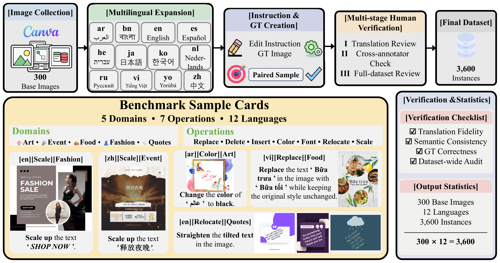
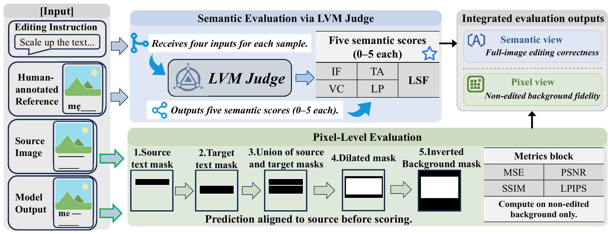

<div align="center">

# Multilingual Image Text Editing Benchmark

<a href="#"></a>
<a href="https://huggingface.co/datasets/lwcheng/MultiTextEdit"></a>
<a href="https://modelscope.cn/datasets/hisheep/MultiTextEdit"></a>

</div>

## 📢 News

* **[2026-05-03]** 🚀 We have released the evaluation code and the multilingual image text editing benchmark!

---

## 📖 Introduction

Existing image text editing benchmarks are dominated by English text and tend to mix text editing with general object editing. As a result, they cannot tell whether a model truly understands non-Latin scripts, RTL layouts, diacritics, or font-level constraints — they only tell whether the model can produce a plausible image.

This benchmark targets that gap. Every sample isolates a **single text editing operation** on a real visual design, then ports the same edit across **12 languages** including Latin, Cyrillic, Bengali, Han, Japanese, Hangul, Arabic, and Hebrew. Each language version is human-authored, cross-checked, and paired with a ground-truth edited image.

To assess editing quality, we adopt a **Dual-View Evaluation Framework**: a multimodal LVM judge produces semantic scores (instruction following, text accuracy, visual consistency, layout preservation, and language/script fidelity), while masked pixel metrics (MSE, PSNR, SSIM, LPIPS) measure background preservation outside the edit region. The combined view scores both **what the model wrote** and **what the model did not change**.



### ✨ Key Features

* **🌐 Multilingual Coverage:** 12 languages spanning 5 scripts and both LTR / RTL writing directions.
* **🎯 Text-Centric Operations:** 7 atom operations — Replace, Delete, Insert, Color, Font, Relocate, Scale.
* **🧪 Dual-View Evaluation:**
  * **Semantic view** — Instruction Following (IF), Text Accuracy (TA), Visual Consistency (VC), Layout Preservation (LP), and **Language/Script Fidelity (LSF)** via a two-stage trace + score judge.
  * **Pixel view** — masked MSE / PSNR / SSIM / LPIPS computed only on the non-edited background, after SIFT alignment.
* **✅ Multi-Stage Human Verification:** translation review, cross-annotator check, and full-dataset audit.

---

## 📊 Dataset Overview

The benchmark comprises **3,600 paired instances**, built from 300 base images each authored in 12 languages.

### 🧩 Dataset Composition

| Item               | Value                                                                             |
| ------------------ | --------------------------------------------------------------------------------- |
| Base images        | 300                                                                               |
| Languages          | 12 (en, zh, ar, bn, es, he, ja, ko, nl, ru, vi, yo)                               |
| Total instances    | 3,600 (300 × 12)                                                                 |
| Visual domains     | 5 (Art, Event, Fashion, Food, Quotes)                                             |
| Editing operations | 7 (color_change, change_font, exchange, insert, relocation, scaling, text_delete) |

Per-domain distribution:

| Domain  | # base images | Operations covered                                                            |
| ------- | ------------: | ----------------------------------------------------------------------------- |
| Art     |            70 | color_change, exchange, insert, relocation, scaling, text_delete              |
| Event   |            60 | color_change, exchange, insert, relocation, scaling, text_delete              |
| Fashion |           110 | color_change, change_font, exchange, insert, relocation, scaling, text_delete |
| Food    |            30 | color_change, exchange, insert, relocation, scaling, text_delete              |
| Quotes  |            30 | color_change, relocation, scaling, text_delete, insert, exchange              |

---

## 🚀 Quick Start

### Setup Environment

```bash
git clone https://github.com/nameoffly/MultiTextEdit.git
cd MultiTextEdit

conda create -n texteditml python=3.10
conda activate texteditml

# Pixel evaluation
pip install -r evaluation/pixel_evaluation/requirements.txt

# Semantic evaluation (LVM judge)
pip install -r evaluation/llm_evaluation/requirements.txt
```

Set up the API key and API base URL in `.env` for the LVM judge:

```bash
cp evaluation/llm_evaluation/.env.example evaluation/llm_evaluation/.env
```

```
OPENAI_API_KEY=${your_api_provider_key}
OPENAI_API_URL=${your_responses_api_base_url}
OPENAI_MODEL=gpt-5.4
```

### Try With the Bundled Examples (no download required)

A small slice of the benchmark is included in this repository under [`examples/dataset/`](examples/dataset/). It contains **15 sample folders** (7 IDs × 2–3 languages each) covering all 7 editing operations and all 5 visual domains, including LTR (en, zh, ko, ja, vi, bn, yo) and RTL (ar, he) writing systems. Use it to inspect the data layout or to smoke-test the evaluation scripts before downloading the full dataset.

### Download Data

Download the full dataset from one of the mirrors and unpack it under the repository root. Both mirrors host identical content.

* **Hugging Face:** [lwcheng/MultiTextEdit](https://huggingface.co/datasets/lwcheng/MultiTextEdit)
* **ModelScope:** [hisheep/MultiTextEdit](https://modelscope.cn/datasets/hisheep/MultiTextEdit)

```bash
# Hugging Face
huggingface-cli download lwcheng/MultiTextEdit --repo-type dataset --local-dir dataset

# or ModelScope
modelscope download --dataset hisheep/MultiTextEdit --local_dir dataset
```

The file structure should be like this:

```
dataset/
├── Art/
│   ├── 001/
│   │   ├── en/
│   │   │   ├── 1.jpg
│   │   │   ├── 1_mask.jpg
│   │   │   ├── Art_001.json
│   │   │   ├── text_color_change_1.jpg
│   │   │   └── text_color_change_1_mask.jpg
│   │   ├── zh/
│   │   └── ...                    # 12 languages per ID
│   └── ...                         # IDs 001..070
│
├── Event/                          # IDs 001..060
├── Fashion/                        # IDs 001..110
├── Food/                           # IDs 001..030
└── Quotes/                         # IDs 001..030
```

Each per-sample JSON records what the evaluator needs:

```json
{
  "id": "TextEditing_Art_001_en",
  "topic": "Art",
  "prompt": "Change the color of 'WORLD ART DAY' to green",
  "editing_method": "color_change",
  "input_image": "1.jpg",
  "output_image": "text_color_change_1.jpg"
}
```

---

## 🛠️ Usage

### Model Output Folder

Run your image editing model on each sample's `1.jpg` using the instruction in `prompt`, and save the result as `{ID}_edited.png` (zero-padded to 3 digits) under a per-model folder that mirrors the dataset layout:

```
predictions/
└── <your_model>/
    ├── Art/
    │   ├── 001/
    │   │   ├── en/001_edited.png
    │   │   ├── zh/001_edited.png
    │   │   └── ...
    │   └── ...
    │
    ├── Event/
    ├── Fashion/
    ├── Food/
    └── Quotes/
```

### Evaluation



**Track 1 (Pixel-level):** masked MSE, PSNR, SSIM, LPIPS computed only on the non-edited background after SIFT alignment.

```bash
python evaluation/pixel_evaluation/evaluate_mse_psnr_masked.py \
    --category Quotes \
    --input_dir dataset/Quotes \
    --pred_dir  predictions/<your_model>/Quotes \
    --output    results/<your_model>/Quotes/mse_psnr.json
```

```bash
python evaluation/pixel_evaluation/evaluate_ssim_lpips_masked.py \
    --category Quotes \
    --input_dir dataset/Quotes \
    --pred_dir  predictions/<your_model>/Quotes \
    --output    results/<your_model>/Quotes/ssim_lpips.json \
    --device cuda
```

**Track 2 (Semantic-level):** powered by a multimodal LVM judge (default: `gpt-5.4` via the OpenAI Responses API), scoring **IF, TA, VC, LP**, and **LSF** (two-stage trace + score) on a 0–5 scale.

```bash
python evaluation/llm_evaluation/evaluate_semantic.py \
    --category Quotes \
    --input_dir   dataset/Quotes \
    --pred_dir    predictions/<your_model>/Quotes \
    --output_dir  results/<your_model>/Quotes \
    --workers 10 --resume
```

`--resume` re-uses any partial result already on disk.

### Evaluating All Categories

```bash
for cat in Art Event Fashion Food Quotes; do
    python evaluation/pixel_evaluation/evaluate_mse_psnr_masked.py \
        --category "$cat" \
        --input_dir "dataset/$cat" \
        --pred_dir  "predictions/<your_model>/$cat" \
        --output    "results/<your_model>/$cat/mse_psnr.json"

    python evaluation/pixel_evaluation/evaluate_ssim_lpips_masked.py \
        --category "$cat" \
        --input_dir "dataset/$cat" \
        --pred_dir  "predictions/<your_model>/$cat" \
        --output    "results/<your_model>/$cat/ssim_lpips.json" \
        --device cuda

    python evaluation/llm_evaluation/evaluate_semantic.py \
        --category "$cat" \
        --input_dir   "dataset/$cat" \
        --pred_dir    "predictions/<your_model>/$cat" \
        --output_dir  "results/<your_model>/$cat" \
        --workers 10 --resume
done
```

### Output Format

The pixel scripts produce a single JSON with `summary`, `by_operation`, `by_language`, and per-sample `details`. The semantic script writes `<Category>.json` (per-sample records), `statistics.json` (per-operation and per-language averages), and a plain-text `averages.txt` summary into `--output_dir`. The `LSF` dimension is reported as `not_applicable` for `text_delete` samples and excluded from the LSF average.

---

## 📚 Scoring Details

The full rubric for every semantic and pixel dimension — including the LSF two-stage trace + score protocol, error tag taxonomy, and aggregation rules — is documented in:

* [docs/evaluation_scoring_explanation_zh.md](docs/evaluation_scoring_explanation_zh.md)
